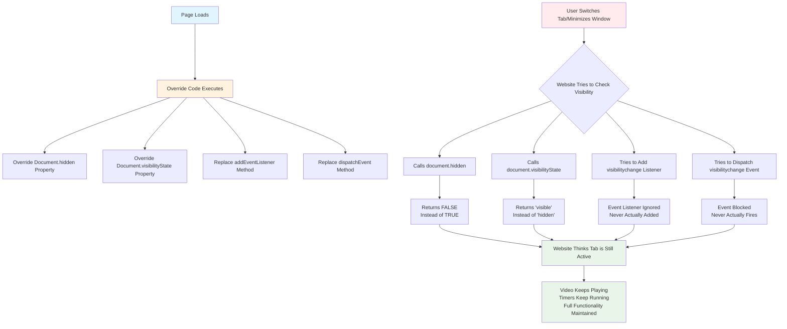

# Instagram Auto Play Fix

## Overview
Keep Instagram videos playing when switching tabs or windows.

### 🎯 Stop Instagram videos from pausing when you switch tabs!
Tired of Instagram videos pausing every time you switch tabs? This extension ensures that your Instagram videos continue playing even when you're browsing other tabs or windows.

## Key Features
✅ **Continuous Video Playback** – Keeps Instagram videos running even when you switch tabs or minimize the browser.  
✅ **Works with Reels, Stories, and Posts** – Ensures seamless playback across all video content.  
✅ **Simple Toggle On/Off Functionality** – Easy to enable or disable as needed.  
✅ **Zero Configuration Needed** – Install and start using instantly.  
✅ **Lightweight & Fast** – Doesn't slow down your browser.

## Perfect For:
- Multitasking while watching Instagram content.  
- Following live videos without interruptions.  
- Listening to Instagram audio while working.  
- Browsing multiple tabs efficiently.

## Installation
1. **Go to the Chrome Web Store** and visit the [Instagram Auto Play Fix](https://chromewebstore.google.com/detail/instagram-auto-play-fix/aahklphdncmbmkmcbgdglefnlfmeegjj) page.
2. Click **Add to Chrome** and confirm installation.
3. Enjoy uninterrupted video playback on Instagram!

## How to Use
1. Install the extension from the Chrome Web Store.
2. Open [Instagram](https://www.instagram.com) in your browser.
3. Play any video (Reels, Stories, or Posts).
4. Switch to another tab – the video keeps playing!

## Notes
- This extension **only works on the Instagram web version** ([instagram.com](https://www.instagram.com)).
- Ensure you keep the Instagram tab open for it to work properly.

## How it works

## Support & Feedback
If you encounter any issues or have feature suggestions, feel free to reach out through the Chrome Web Store review section.

---
**Enjoy uninterrupted Instagram videos while you multitask! 🚀**

